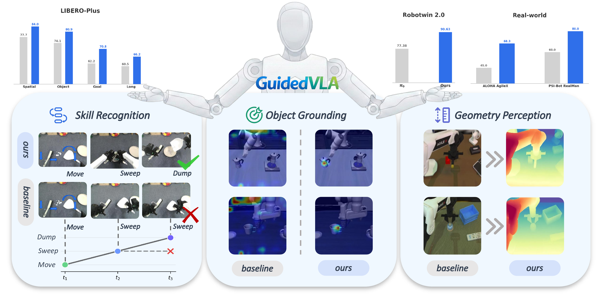
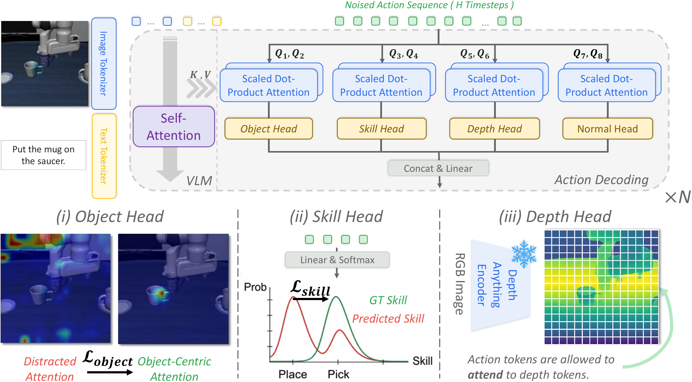
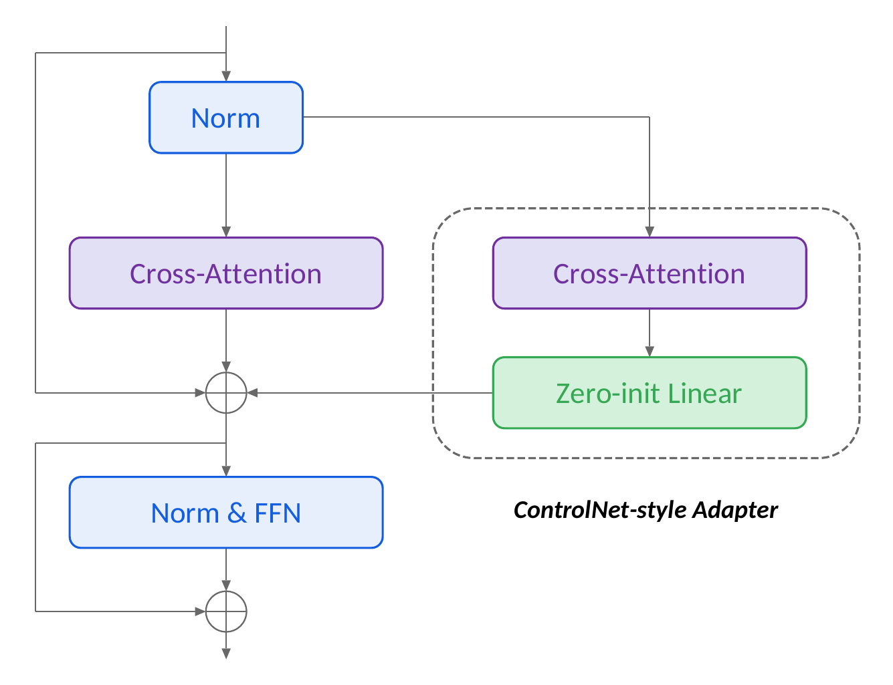

# GuidedVLA: Specifying Task-Relevant Factors via Plug-and-Play Action Attention Specialization

<div align="center">

<p>
Xiaosong Jia<sup>&#42;&#8224;,1,2</sup>, Bowen Yang<sup>&#42;,3</sup>, Zuhao Ge<sup>&#42;,1,2</sup>, Xian Nie<sup>&#42;,3</sup>, Yuchen Zhou<sup>&#42;,1,2</sup>, Cunxin Fan<sup>&#42;&#8224;,3</sup>, Yufeng Li<sup>3</sup>, Yilin Chai<sup>3</sup>, Chao Jing<sup>1,2</sup>, Zijian Liang<sup>3</sup>, Qingwen Bu<sup>4</sup>, Haidong Cao<sup>1,2</sup>, Chao Wu<sup>1,2</sup>, Qifeng Li<sup>3</sup>, Zhenjie Yang<sup>3</sup>, Chenhe Zhang<sup>1,2</sup>, Hongyang Li<sup>4</sup>, Zuxuan Wu<sup>&#9993;,1,2</sup>, Junchi Yan<sup>&#9993;,3</sup>, Yu-Gang Jiang<sup>&#9993;,1,2</sup>
</p>

<p>
<sup>1</sup>Institute of Trustworthy Embodied AI (TEAI), Fudan University &nbsp;
<sup>2</sup>Shanghai Key Laboratory of Multimodal Embodied AI &nbsp;
<sup>3</sup>Shanghai Jiao Tong University &nbsp;
<sup>4</sup>OpenDriveLab, The University of Hong Kong
</p>

<p><sup>&#42;</sup> Core Contributors &nbsp;&nbsp; <sup>&#8224;</sup> Project Lead &nbsp;&nbsp; <sup>&#9993;</sup> Correspondence Authors</p>

[[Paper]](https://arxiv.org/abs/2605.12369) &nbsp;|&nbsp; [[Project Page]](https://guidedvla.github.io/project_page/) &nbsp;|&nbsp; [[Code]](https://github.com/GuidedVLA/GuidedVLA) &nbsp;|&nbsp; [[Checkpoint]](https://huggingface.co/ybwowen/pi0-libero-object-depth-skill) &nbsp;|&nbsp; [[Dataset]](https://huggingface.co/datasets/ybwowen/libero) &nbsp;|&nbsp; [[Citation]](#citation)

</div>

---

**GuidedVLA** is a VLA paradigm where the action decoder is explicitly guided to capture task-relevant information — object grounding, spatial geometry, and temporal skill logic — through per-head attention specialization. Instead of relying on end-to-end supervision to implicitly learn such features, GuidedVLA repurposes dedicated attention heads to specialize in distinct task-relevant factors, supervised by manually defined auxiliary signals.

This repository extends [openpi](https://github.com/Physical-Intelligence/openpi) (π₀ / π₀.₅) with the GuidedVLA framework and a full PyTorch training pipeline.

## Release Status

- [x] Release code
- [x] Release LIBERO training dataset: [ybwowen/libero](https://huggingface.co/datasets/ybwowen/libero)
- [x] Release LIBERO checkpoint: [ybwowen/pi0-libero-object-depth-skill](https://huggingface.co/ybwowen/pi0-libero-object-depth-skill)
- [ ] Release RoboTwin training dataset

<p align="center">
  
</p>

## Key Results

**LIBERO-Plus** (robustness benchmark across 7 perturbation dimensions):

| Model | Spatial | Object | Goal | Long | **Total** |
|---|---|---|---|---|---|
| π₀ baseline | 77.7 | 74.1 | 61.4 | 60.1 | 68.2 |
| w/ object head | 80.6 | **82.5** | 67.1 | 64.0 | 73.4 |
| w/ skill head | 79.8 | 78.9 | 68.9 | 62.7 | 72.5 |
| w/ depth head | 81.4 | **79.0** | 65.4 | 61.8 | 71.7 |
| **GuidedVLA (ours)** | **84.0** | 80.9 | **70.8** | **66.2** | **75.4** |

**RoboTwin 2.0** (8 manipulation tasks, out-of-domain): π₀ **77.38%** → GuidedVLA **90.63%**

**Real-world** (ALOHA AgileX + PSI-Bot RealMan, 6 household/lab tasks):

| Generalization | Base Policy | GuidedVLA |
|---|---|---|
| In-domain | 55.8% | **75.8%** |
| Scene | 44.2% | **67.5%** |
| Lighting | 57.5% | **79.2%** |

---

## Method Overview

GuidedVLA treats the action decoder not as a monolithic learner, but as an **assembly of functionally specialized components**. Attention heads are supervised by task-specific auxiliary signals:

<p align="center">
  
</p>

1. **Object Head** (Visual Grounding): Guides a subset of heads H_obj to align their attention maps with ground-truth object-region masks via a weighted negative log-likelihood loss L_object. Forces action tokens to attend to the relevant objects and suppress distractors.

2. **Skill Head** (Temporal Logic): Designates heads H_skill to classify the current sub-skill or task phase from their output features, supervised by a KL-divergence loss L_skill against soft skill labels. Captures long-horizon temporal structure without requiring hard skill boundaries.

3. **Depth Head** (Geometry Perception): Injects 3D spatial cues from a frozen depth encoder ([Depth Anything V3](https://github.com/DepthAnything/Depth-Anything-V3)) as additional keys and values for a subset of heads H_depth. Structural constraint; no loss term required.

**Plug-and-Play via ControlNet Adapter**: Specialized heads are introduced as a lightweight control branch fused into the pretrained backbone via a zero-initialized projection (ZeroConv), matching the ControlNet residual strategy:

```
Attn_final(x) = Attn_main(x) + ZeroConv(Attn_specified(x))
```

<p align="center">
  
</p>

The branch starts with zero contribution and gradually learns to inject factor-specific biases, preserving pretrained capabilities throughout training.

---

## Installation

Clone the repo with submodules:

```bash
git clone --recurse-submodules https://github.com/GuidedVLA/GuidedVLA.git
cd GuidedVLA

# Or if already cloned:
git submodule update --init --recursive
```

We use [uv](https://docs.astral.sh/uv/) to manage Python dependencies:

```bash
GIT_LFS_SKIP_SMUDGE=1 uv sync
GIT_LFS_SKIP_SMUDGE=1 uv pip install -e .
```

Apply the necessary patches to the `transformers` library (required for AdaRMS, activation precision, and KV-cache control):

```bash
cp -r ./src/openpi/models_pytorch/transformers_replace/* .venv/lib/python3.11/site-packages/transformers/
```

> **Note**: With the default uv hardlink mode, this permanently patches the transformers cache. To fully undo: `uv cache clean transformers`.

### Depth Encoder Setup

GuidedVLA uses [Depth Anything V3 Small](https://github.com/DepthAnything/Depth-Anything-V3) as the frozen depth encoder. Download the DA3-SMALL checkpoint and set `depth_model_name` to the local checkpoint path in your config:

```python
depth_model_name = "path/to/da3-small"  # local checkpoint path
```

---

## Checkpoints

The released GuidedVLA checkpoint is hosted on Hugging Face:

| Model | Config | Checkpoint |
|---|---|---|
| GuidedVLA LIBERO object + depth + skill | `pi0_libero_object_depth_skill` | [`ybwowen/pi0-libero-object-depth-skill`](https://huggingface.co/ybwowen/pi0-libero-object-depth-skill) |

The checkpoint contains `model.safetensors` and normalization statistics under
`assets/ybwowen/libero/norm_stats.json`.

GuidedVLA is built on top of the π₀ / π₀.₅ base models from Physical Intelligence:

| Model | Checkpoint |
|---|---|
| π₀ base | `gs://openpi-assets/checkpoints/pi0_base` |
| π₀.₅ base | `gs://openpi-assets/checkpoints/pi05_base` |

Convert a JAX checkpoint to PyTorch format before training:

```bash
uv run examples/convert_jax_model_to_pytorch.py \
    --checkpoint_dir /path/to/jax/checkpoint \
    --config_name pi0_libero \
    --output_path /path/to/pytorch/checkpoint \
    --precision float32
```

---

## Training

### 1. Prepare your dataset

For GuidedVLA LIBERO training, we provide the released LeRobot-format dataset on Hugging Face:
[`ybwowen/libero`](https://huggingface.co/datasets/ybwowen/libero). The default
GuidedVLA LIBERO configs in [src/openpi/training/config.py](src/openpi/training/config.py)
use this dataset, including the released checkpoint config
`pi0_libero_object_depth_skill`.

If you use your own data, convert it to [LeRobot](https://github.com/huggingface/lerobot) format.

For GuidedVLA's auxiliary supervisions, your dataset should additionally include:
- **Object head**: `agentview_attention_object_mask` and `wrist_attention_object_mask`
- **Skill head**: `observation.skill_id` for online soft skill label construction
- **Depth head**: RGB images (depth is computed on-the-fly by the frozen encoder)

If you use a different dataset schema, update the data transforms in
[src/openpi/training/config.py](src/openpi/training/config.py) so the object and
skill targets are repacked into the keys consumed by the PyTorch trainer.

### 2. Configure your training run

Edit your config in [src/openpi/training/config.py](src/openpi/training/config.py). The key GuidedVLA configs are:

| Config | Description |
|---|---|
| `pi0_libero_object_depth_skill` | Full GuidedVLA: object + depth + skill heads |
| `pi0_libero_object` | Object head only |
| `pi0_libero_depth` | Depth head only |
| `pi0_libero_skill` | Skill head only |
| `pi0_libero` | π₀ baseline (no guided heads) |

Key config fields in `Pi0Config`:

```python
# ControlNet-style attention branch
control_attention_enabled: bool = True
control_attention_target: str = "expert"   # "expert", "paligemma", or "both"
control_attention_num_heads: int | None = 8  # heads in control branch
control_attention_use_headwise_gate: bool = True

# Depth
use_depth: bool = True
depth_model_name: str = "path/to/da3-small"
guided_layer_indices: list = [9, 10, 11, 12]
depth_head_indices: list = [4, 5]

# Skill
use_skill_loss: bool = True
skill_num_classes: int = 4  # 3 effective skills + 1 null/background class
skill_head_indices: list = [6, 7]
```

For the default LIBERO full GuidedVLA config, the auxiliary loss weights are:

```python
object_loss_weight: float = 0.001
skill_loss_weight: float = 0.001
```

### 3. Compute normalization statistics

```bash
uv run scripts/compute_norm_stats.py --config-name pi0_libero_object_depth_skill
```

### 4. Launch training

```bash
# Single GPU
uv run scripts/train_pytorch.py pi0_libero_object_depth_skill \
    --exp_name my_run --save_interval 2000

# Multi-GPU (single node)
uv run torchrun --standalone --nnodes=1 --nproc_per_node=8 \
    scripts/train_pytorch.py pi0_libero_object_depth_skill \
    --exp_name my_run --save_interval 2000

# Resume from latest checkpoint
uv run scripts/train_pytorch.py pi0_libero_object_depth_skill \
    --exp_name my_run --resume

# Multi-node (e.g., 2 nodes × 8 GPUs)
uv run torchrun \
    --nnodes=2 --nproc_per_node=8 \
    --node_rank=<rank> --master_addr=<ip> --master_port=<port> \
    scripts/train_pytorch.py pi0_libero_object_depth_skill \
    --exp_name my_run --save_interval 2000
```

Checkpoints are saved to `./checkpoints/<config_name>/<exp_name>/`.

### Precision

GuidedVLA trains with **float32 master weights** and `torch.autocast(bfloat16)` for mixed-precision computation.

---

## Evaluation

### LIBERO-Plus

The current LIBERO-Plus workflow uses:
- `scripts/serve_policy.py` for the PyTorch policy server
- `examples/libero_plus/main.py` for a single evaluation job
- `examples/libero_plus/eval_libero_plus.py` for multi-GPU / multi-process batch evaluation

#### 1. Prepare the LIBERO-Plus simulator environment

`examples/libero_plus/main.py` runs inside the LIBERO-Plus simulator environment, which is separate from the main training environment:

```bash
uv venv --python 3.8 examples/libero_plus/.venv
source examples/libero_plus/.venv/bin/activate

uv pip sync examples/libero_plus/requirements.txt third_party/LIBERO-plus/requirements.txt \
    --extra-index-url https://download.pytorch.org/whl/cu113 \
    --index-strategy=unsafe-best-match

uv pip install -e packages/openpi-client
uv pip install -e third_party/LIBERO-plus
uv pip install -r third_party/LIBERO-plus/extra_requirements.txt

export PYTHONPATH=$PYTHONPATH:$(pwd)/third_party/LIBERO-plus
```

#### 2. Launch the policy server

In one terminal, start the checkpoint server from the repo root:

```bash
CUDA_VISIBLE_DEVICES=0 uv run --no-sync scripts/serve_policy.py \
    --env LIBERO \
    --port 8000 \
    policy:checkpoint \
    --policy.config pi0_libero_object_depth_skill \
    --policy.dir hf://models/ybwowen/pi0-libero-object-depth-skill
```

#### 3. Run a single LIBERO-Plus job

In a second terminal, use the simulator environment to evaluate one suite or one perturbation category:

```bash
source examples/libero_plus/.venv/bin/activate
export PYTHONPATH=$PYTHONPATH:$(pwd)/third_party/LIBERO-plus

python examples/libero_plus/main.py \
    --host 127.0.0.1 \
    --port 8000 \
    --task-suite-name libero_object \
    --category "Objects Layout" \
    --num-trials-per-task 1 \
    --video-out-path data/libero_plus/videos \
    --results-json-path data/libero_plus/libero_object.json
```

Useful `main.py` arguments:
- `--task-suite-name`: `libero_spatial`, `libero_object`, `libero_goal`, `libero_10`, or `all`
- `--category`: one of `Objects Layout`, `Camera Viewpoints`, `Robot Initial States`, `Language Instructions`, `Light Conditions`, `Background Textures`, `Sensor Noise`
- `--task-ids`: e.g. `0`, `0,3,7`, or `10-19`
- `--replan-steps`: action chunk size requested from the server
- `--results-json-path`: rolling JSON summary; when `--category` is set, the category suffix is appended automatically

#### 4. Run parallel evaluation across GPUs

`examples/libero_plus/eval_libero_plus.py` starts one policy server per GPU and dispatches evaluation jobs automatically:

```bash
.venv/bin/python examples/libero_plus/eval_libero_plus.py \
    --checkpoint-dir hf://models/ybwowen/pi0-libero-object-depth-skill \
    --policy-config pi0_libero_object_depth_skill \
    --gpu-ids 0,1,2,3 \
    --client-python examples/libero_plus/.venv/bin/python \
    --libero-plus-path third_party/LIBERO-plus
```

Useful `eval_libero_plus.py` arguments:
- `--task-suites`: comma-separated suites, default is `libero_spatial,libero_object,libero_goal,libero_10`
- `--categories`: comma-separated perturbation categories
- `--task-ids`: restrict to a subset of tasks
- `--num-trials-per-task`: number of rollouts per task

Outputs are written under:
- `data/libero_plus/` for JSON results and rollout videos
- `logs/libero_plus/` for per-worker logs

### RoboTwin 2.0

Evaluation scripts for RoboTwin 2.0 are provided in `examples/robotwin/`.
Initialize RoboTwin with `git submodule update --init --recursive third_party/RoboTwin` before running the RoboTwin pipeline.
RoboTwin evaluation follows the same policy-server workflow: serve a checkpoint with `scripts/serve_policy.py`, then run `examples/robotwin/main.py` for the target task.

For the full RoboTwin setup, data conversion, training configs, and evaluation flow, see [examples/robotwin/README.md](examples/robotwin/README.md).

---

## Citation

If you find this work useful, please cite:

```bibtex
@misc{jia2026guidedvla,
  title         = {GuidedVLA: Specifying Task-Relevant Factors via Plug-and-Play Action Attention Specialization},
  author        = {Xiaosong Jia and Bowen Yang and Zuhao Ge and Xian Nie and Yuchen Zhou and Cunxin Fan and Yufeng Li and Yilin Chai and Chao Jing and Zijian Liang and Qingwen Bu and Haidong Cao and Chao Wu and Qifeng Li and Zhenjie Yang and Chenhe Zhang and Hongyang Li and Zuxuan Wu and Junchi Yan and Yu-Gang Jiang},
  year          = {2026},
  eprint        = {2605.12369},
  archivePrefix = {arXiv},
  primaryClass  = {cs.RO},
  url           = {https://arxiv.org/abs/2605.12369},
}
```

---

## Acknowledgements

GuidedVLA is built as an extension of [openpi](https://github.com/Physical-Intelligence/openpi) by Physical Intelligence. We thank the openpi team for open-sourcing their codebase and pretrained models.

---

## License and Third-Party Notices

The GuidedVLA source code in this repository is released under the
[Apache License 2.0](LICENSE), unless a file states otherwise.

Gemma and PaliGemma related components and model weights are subject to the
Gemma terms in [LICENSE_GEMMA.txt](LICENSE_GEMMA.txt). The repository also uses
third-party projects through submodules and dependencies, including openpi,
Depth Anything V3, LIBERO, LIBERO-Plus, RoboTwin, and ALOHA. Those projects
remain governed by their own licenses and model or dataset terms.

---

<details>
<summary><b>openpi Documentation (original)</b></summary>

openpi holds open-source models and packages for robotics, published by the [Physical Intelligence team](https://www.physicalintelligence.company/).

Currently, this repo contains three types of models:
- the [π₀ model](https://www.physicalintelligence.company/blog/pi0), a flow-based vision-language-action model (VLA).
- the [π₀-FAST model](https://www.physicalintelligence.company/research/fast), an autoregressive VLA, based on the FAST action tokenizer.
- the [π₀.₅ model](https://www.physicalintelligence.company/blog/pi05), an upgraded version of π₀ with better open-world generalization.

### Updates

- [Sept 2025] PyTorch support released in openpi.
- [Sept 2025] π₀.₅ released with better open-world generalization.
- [Jun 2025] [Instructions](examples/droid/README_train.md) for training on the full [DROID dataset](https://droid-dataset.github.io/).

### Base Model Checkpoints

| Model | Checkpoint |
|---|---|
| π₀ | `gs://openpi-assets/checkpoints/pi0_base` |
| π₀-FAST | `gs://openpi-assets/checkpoints/pi0_fast_base` |
| π₀.₅ | `gs://openpi-assets/checkpoints/pi05_base` |

### Fine-Tuned Checkpoints

| Model | Checkpoint |
|---|---|
| π₀-FAST-DROID | `gs://openpi-assets/checkpoints/pi0_fast_droid` |
| π₀-DROID | `gs://openpi-assets/checkpoints/pi0_droid` |
| π₀-ALOHA-towel | `gs://openpi-assets/checkpoints/pi0_aloha_towel` |
| π₀-ALOHA-tupperware | `gs://openpi-assets/checkpoints/pi0_aloha_tupperware` |
| π₀-ALOHA-pen-uncap | `gs://openpi-assets/checkpoints/pi0_aloha_pen_uncap` |
| π₀.₅-LIBERO | `gs://openpi-assets/checkpoints/pi05_libero` |
| π₀.₅-DROID | `gs://openpi-assets/checkpoints/pi05_droid` |

Checkpoints are automatically downloaded and cached in `~/.cache/openpi`. Override with `OPENPI_DATA_HOME`.

### Running Inference

```python
from openpi.training import config as _config
from openpi.policies import policy_config
from openpi.shared import download

config = _config.get_config("pi05_droid")
checkpoint_dir = download.maybe_download("gs://openpi-assets/checkpoints/pi05_droid")
policy = policy_config.create_trained_policy(config, checkpoint_dir)

action_chunk = policy.infer({
    "observation/exterior_image_1_left": ...,
    "observation/wrist_image_left": ...,
    "prompt": "pick up the fork",
})["actions"]
```

For step-by-step examples: [DROID](examples/droid/README.md) | [ALOHA](examples/aloha_real/README.md) | [Remote Inference](docs/remote_inference.md)

### Troubleshooting

| Issue | Resolution |
|---|---|
| `uv sync` fails | Remove `.venv` and retry. Update uv: `uv self update`. |
| Out of GPU memory | Use multi-GPU DDP (`--nproc_per_node=N`) or reduce batch size. |
| Missing norm stats | Run `scripts/compute_norm_stats.py --config-name <name>` first. |
| Dataset download fails | Check internet / HuggingFace login: `huggingface-cli login`. |
| CUDA errors | Try uninstalling system CUDA; uv installs the correct version. |
| Diverging training loss | Check `norm_stats.json` for near-zero `std`/`q01`/`q99` values; adjust manually. |

</details>
